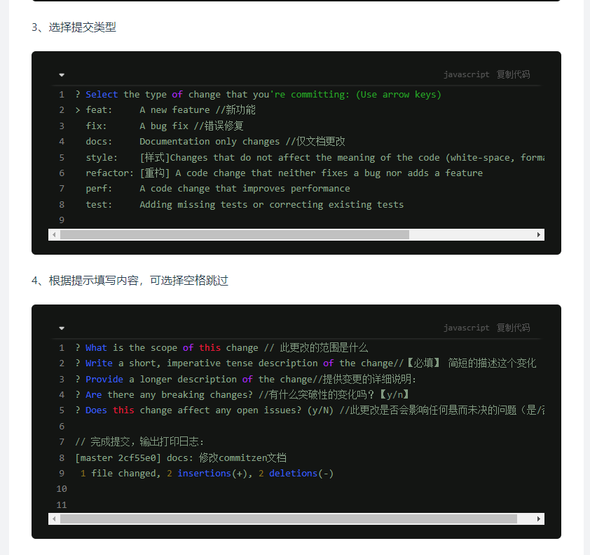

This is a [Next.js](https://nextjs.org/) project bootstrapped with [`create-next-app`](https://github.com/vercel/next.js/tree/canary/packages/create-next-app).

## Getting Started

First, run the development server:

```bash
npm run dev
# or
yarn dev
# or
pnpm dev
# or
bun dev
```

Open [http://localhost:3000](http://localhost:3000) with your browser to see the result.

You can start editing the page by modifying `app/page.jsx`. The page auto-updates as you edit the file.

This project uses [`next/font`](https://nextjs.org/docs/basic-features/font-optimization) to automatically optimize and load Inter, a custom Google Font.

## Learn More

To learn more about Next.js, take a look at the following resources:

- [Next.js Documentation](https://nextjs.org/docs) - learn about Next.js features and API.
- [Learn Next.js](https://nextjs.org/learn) - an interactive Next.js tutorial.

You can check out [the Next.js GitHub repository](https://github.com/vercel/next.js/) - your feedback and contributions are welcome!

## Deploy on Vercel

The easiest way to deploy your Next.js app is to use the [Vercel Platform](https://vercel.com/new?utm_medium=default-template&filter=next.js&utm_source=create-next-app&utm_campaign=create-next-app-readme) from the creators of Next.js.

Check out our [Next.js deployment documentation](https://nextjs.org/docs/deployment) for more details.

Git 有很多的 hooks, 让我们在不同的阶段,对代码进行不同的操作,控制提交到仓库的代码的规范性,和准确性, 以下只是几个常用的钩子

husky 是一个 Git 钩子（Git hooks）工具，它可以让你在 Git 事件发生时执行脚本，进行代码格式化、测试等操作。
pre-commit：在执行 Git commit 命令之前触发，用于在提交代码前进行代码检查、格式化、测试等操作,判断提交的代码是否符合规范。
commit-msg：在提交消息（commit message）被创建后，但提交操作尚未完成之前触发，用于校验提交消息的格式和内容,判断 commit 信息是否符合规范。
pre-push：在执行 Git push 命令之前触发，用于在推送代码前进行额外检查、测试等操作,执行测试,避免对以前的内容造成影响。


husky 操作 git 钩子的工具
lint-staged 本地暂存代码检查工具
commitlint commit 信息校验工具
commitizen 辅助 commit 信息 ,就像这样,通过选择输入,规范提交信息


```npm run prepare # 初始化husky,将 git hooks 钩子交由,husky执行```

占位标签解析：
type:代表某次提交的类型，比如是修复一个bug还是增加一个新的feature。所有的type类型如下：
scope:scope说明commit影响的范围。scope依据项目而定，
例如在业务项目中可以依据菜单或者功能模块划分，
如果是组件库开发，则可以依据组件划分。
subject:是commit的简短描述
body:提交代码的详细描述
footer:如果代码的提交是不兼容变更或关闭缺陷，则Footer必需，否则可以省略。

feat[特性]:新增feature
fix[修复]: 修复bug     
docs[文档]: 仅仅修改了文档，比如README, CHANGELOG, CONTRIBUTE等等
style[格式]: 仅仅修改了空格、格式缩进、都好等等，不改变代码逻辑
refactor[重构]: 代码重构，没有加新功能或者修复bug
perf[优化]: 优化相关，比如提升性能、体验
test[测试]: 测试用例，包括单元测试、集成测试等
chore[工具]: 改变构建流程、或者增加依赖库、工具等
revert[回滚]: 回滚到上一个版本
